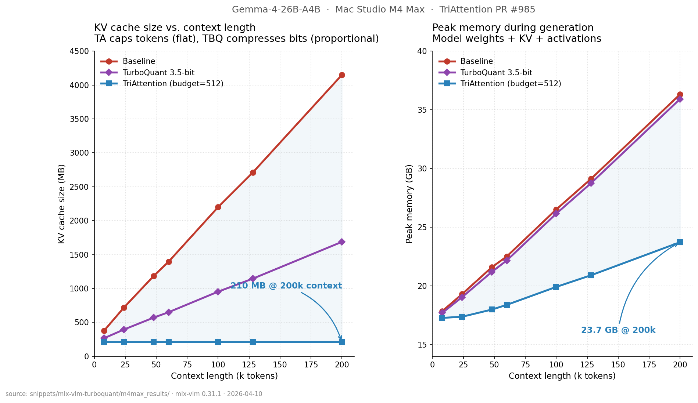
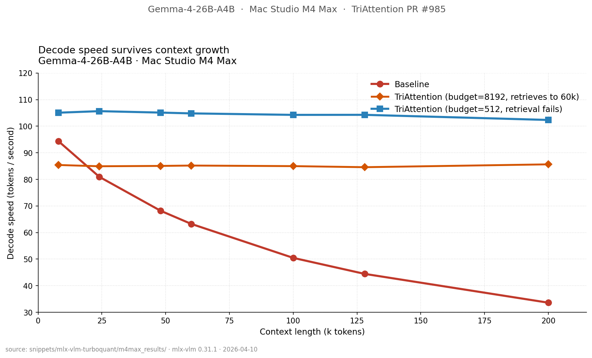
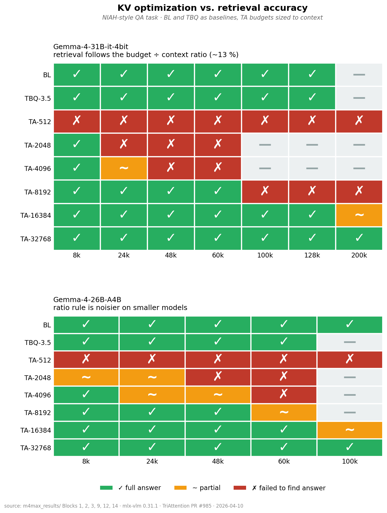
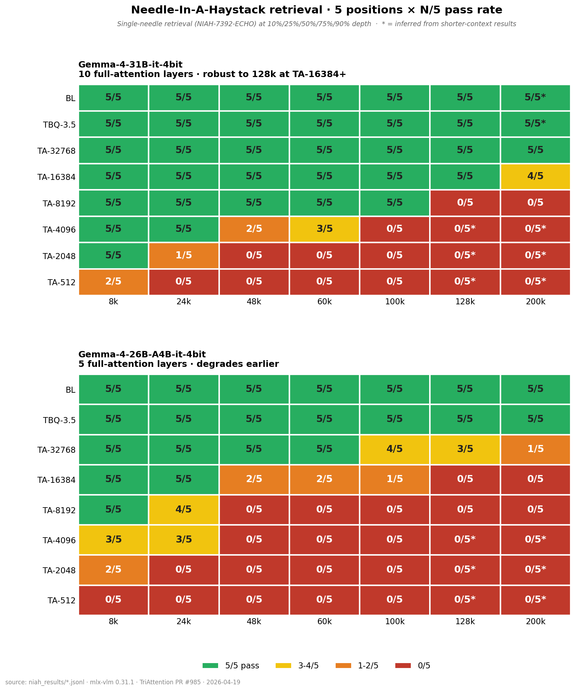
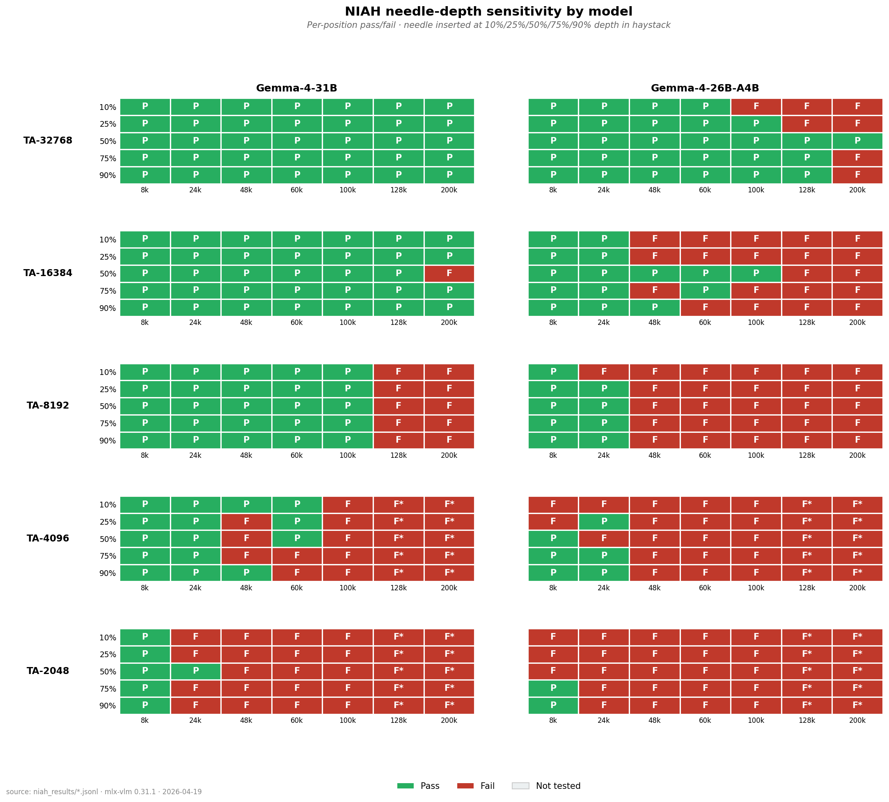
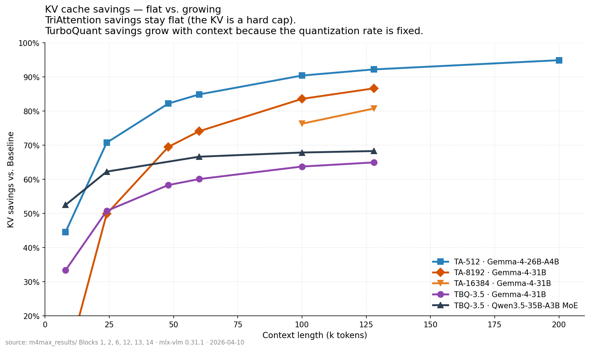
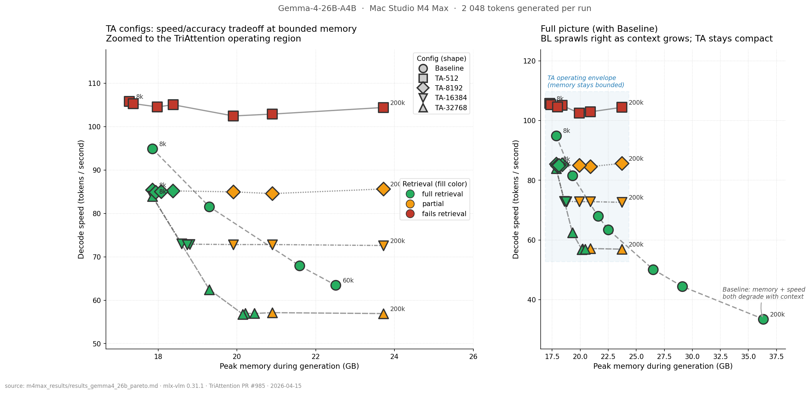

# MLX-VLM KV-Cache Optimization Benchmarks

Independent benchmarks of two KV-cache optimization techniques in
[MLX-VLM](https://github.com/Blaizzy/mlx-vlm) on Apple Silicon:
**TurboQuant** (KV-cache quantization) and **TriAttention** (KV-cache
token pruning). Both implemented by
[@Prince_Canuma](https://github.com/Blaizzy).

## Key Findings

### 1. TriAttention makes long-context inference feel like short-context inference

On Gemma-4-26B-A4B (Mac Studio M4 Max, 64 GB), TriAttention budget=512
holds the KV cache at **210 MB** and decode speed at **~102 tok/s**
whether the context is 8k or 200k tokens. Baseline KV grows to 4.1 GB
and decode drops to 34 tok/s at the same context length.





### 2. But TriAttention drops facts from the context

It works by evicting tokens from the KV cache. If the answer tokens get
evicted, retrieval fails — or worse, the model hallucinates
similar-sounding content. On Gemma-4-31B, retrieval stays correct when
the TA budget is at least ~13% of the context length. Below that,
details start dropping. On smaller models the threshold is higher and
less predictable.



### 3. NIAH confirms TA needs budget sized to context

We ran a dedicated Needle-In-A-Haystack benchmark: insert a known
needle at 5 controlled depths (10%–90%), test retrieval across 8k–200k
context on both Gemma-4-31B and 26B-A4B. Results confirm the Northwind
QA findings with statistical depth (5 runs per cell instead of 1):



31B with 10 full-attention layers is much more robust — TA-16384 holds
5/5 to 128k and 4/5 at 200k. 26B with 5 full-attention layers degrades
earlier at every budget level. BL and TBQ are 5/5 everywhere tested.

The position-level breakdown shows where in the text retrieval fails
first:



26B shows an early-position vulnerability — the 10% depth (near the
start) fails first because TriAttention preferentially evicts early
tokens.

### 4. TurboQuant is the safer choice when you need correct answers

It compresses KV bits instead of dropping tokens, preserving retrieval
at 60-65% KV savings with no tuning required. The tradeoff: it doesn't
meaningfully reduce peak memory (KV bytes shrink but attention buffers
don't), and it breaks on fully-dense VLMs.

### 5. They target different workloads — don't stack them

Use TriAttention for reasoning, summarization, or open generation where
speed and memory matter more than verbatim recall. Use TurboQuant for
QA, retrieval, or any task where the answer needs to come from the
context. Combining both collapses output quality.

### 6. Four things we tested that didn't work

So you don't have to: (a) domain-specific TA calibration doesn't
recover retrieval, (b) TBQ breaks on dense VLMs at both 3.5-bit and
4-bit, (c) TBQ+TA stacking produces degenerate output, and (d) the TA
retrieval "cliff" at long context is fixable by scaling the budget —
it's a tuning problem, not a fundamental limitation.

---

## Headline Numbers

**Gemma-4-31B-it-4bit at 60k context (M4 Max):**

| Config | KV cache | Peak memory | Decode speed | Retrieval |
|--------|---------:|------------:|-------------:|:---------:|
| Baseline (FP16 KV) | 5580 MB | 35.38 GB | 16.7 tok/s | correct |
| TurboQuant 3.5-bit | 2227 MB | 33.14 GB | 16.2 tok/s | correct |
| TriAttention (512) |  842 MB | 23.32 GB | 24.4 tok/s | fails |
| TriAttention (8192) | 1444 MB | 24.42 GB | 20.7 tok/s | correct |

**Gemma-4-26B-A4B KV flatline (8k to 200k context, M4 Max):**

| Context | Baseline KV | TA-512 KV | Baseline peak | TA-512 peak | Baseline decode | TA-512 decode |
|--------:|------------:|----------:|--------------:|------------:|----------------:|--------------:|
|     8k |      380 MB |  **210 MB** |     17.85 GB |    17.27 GB |     94.4 tok/s |   105.1 tok/s |
|    24k |      720 MB |  **210 MB** |     19.30 GB |    17.37 GB |     81.0 tok/s |   105.7 tok/s |
|    48k |    1 185 MB |  **210 MB** |     21.59 GB |    17.98 GB |     68.2 tok/s |   105.1 tok/s |
|    60k |    1 395 MB |  **210 MB** |     22.50 GB |    18.38 GB |     63.3 tok/s |   104.8 tok/s |
|   100k |    2 200 MB |  **210 MB** |     26.51 GB |    19.91 GB |     50.5 tok/s |   104.3 tok/s |
|   128k |    2 710 MB |  **210 MB** |     29.11 GB |    20.90 GB |     44.4 tok/s |   104.3 tok/s |
|   200k |    4 150 MB |  **210 MB** |     36.32 GB |    23.72 GB |     33.6 tok/s |   102.4 tok/s |

**TriAttention retrieval budget-ratio rule (Gemma-4-31B):**

| Budget | Context | Ratio | Retrieval | KV cache |
|-------:|--------:|------:|:---------:|---------:|
|    512 |    60k | 0.85% | fails |   842 MB |
|  8 192 | 100k | 8.2% | fails | 1 444 MB |
| 16 384 | 200k | 8.2% | partial | 2 084 MB |
|  8 192 |  60k | 13.7% | correct | 1 444 MB |
| 16 384 | 128k | 12.8% | correct | 2 084 MB |
| 32 768 | 200k | 16.4% | correct | 3 364 MB |

Threshold: budget/context >= ~13% for full retrieval, 8-13% partial, <8% fails.

## When to Use Which Technique

| Workload | Recommendation |
|----------|----------------|
| Long-context QA / retrieval, 30B+ | **TBQ 3.5-bit** or **TA with budget >= 0.15 x context** |
| Long-context reasoning / generation | **TA** (budget 1024-2048) |
| Memory-constrained, exact retrieval not needed | **TA** (budget 512) |
| Dense-attention VLMs | **Neither** — stay baseline |
| MRoPE models (Qwen family) | **TBQ only** — TA rejects MRoPE |
| Stacking TBQ + TA | **Don't** — output collapses |

## Design Space

KV savings scale differently between the two techniques:



TriAttention savings grow with context (fixed cap = larger relative
savings). TurboQuant savings stay roughly constant (fixed compression
rate).

The full speed x memory x accuracy tradeoff space on Gemma-4-26B-A4B:



## Independent Confirmation

The MLX-VLM PR author (@Prince_Canuma) published complementary benchmarks
that back the same picture:

- **[MATH-500 reasoning](https://x.com/Prince_Canuma/status/2044040708571410763)**
  on Gemma-4-26B-A4B-it 5-bit (M3 Ultra, 500 problems): baseline
  **77.4%**, TA-2048 **76.6%** (-0.8%), TA-512 72.0% (-5.4%). TA-2048
  is essentially baseline-equivalent for reasoning. His implementation
  outperforms the paper's reference numbers at every budget point.

- **[Perplexity on wikitext-2](https://x.com/Prince_Canuma/status/2044043971391893765)**
  on Gemma-4-31B base: TA-256 near-baseline across 1K-50K context.

- A separate [NIAH-style test](https://x.com/no_stp_on_snek) on the same
  model (Gemma-4-26B-A4B 4-bit, ~6.6k context) shows TA-1024
  hallucinating "PURPLE RAIN 774" for the inserted needle "PURPLE
  ELEPHANT 7742" — consistent with the budget-ratio threshold.

Four independent measurements converge on the same regime split:
TriAttention works well for reasoning/generation but drops facts during
retrieval unless the budget is sized to the context.

## Models Benchmarked

| Model | Full-attn layers | TurboQuant | TriAttention |
|-------|----------------:|:----------:|:------------:|
| [Qwen3.5-9B-4bit](https://huggingface.co/mlx-community/Qwen3.5-9B-4bit) | 8 / 32 (hybrid) | works | unsupported (MRoPE) |
| [Qwen3-VL-8B-4bit](https://huggingface.co/mlx-community/Qwen3-VL-8B-Instruct-4bit) | 36 / 36 (dense) | breaks | unsupported (MRoPE) |
| [Gemma-4-26B-A4B-4bit](https://huggingface.co/mlx-community/gemma-4-26b-a4b-it-4bit) | 5 / 30 (MoE) | works | works |
| [Gemma-4-31B-4bit](https://huggingface.co/mlx-community/gemma-4-31b-it-4bit) | 10 / 60 (dense) | works | works (cleanest ratio rule) |
| [Qwen3.5-35B-A3B-4bit](https://huggingface.co/mlx-community/Qwen3.5-35B-A3B-4bit) | hybrid (MoE) | works | unsupported (MRoPE) |

**Compatibility rules:**
- TurboQuant works on hybrid/MoE models (few full-attention layers). Breaks on fully-dense models where all layers get quantized.
- TriAttention requires standard RoPE or ProportionalRoPE. Rejects MRoPE (all Qwen models). Auto-skips sliding-window layers.

## Methodology

Two benchmark scripts measure different aspects of retrieval under
KV-cache optimization:

**`bench_northwind.py`** — Multi-fact QA retrieval. Tiles a synthetic
"Northwind Station" handbook to a target context length, asks the model
to find three embedded facts, and grades the output by hand. Each
(config, tier) cell is a single run. Results are directional — strong
signal where the same config succeeds across multiple tiers, weaker on
borderline cases.

**`bench_niah.py`** — Needle-In-A-Haystack retrieval. Inserts a known
needle (`NIAH-7392-ECHO`) at a controlled depth (10%–90%) within tiled
filler text. Sweeps across context lengths, needle positions, and
KV-cache configs. Each (config, tier) cell aggregates 5 runs (one per
position), giving N/5 pass rates. More statistical power than the
Northwind benchmark.

Both scripts capture prefill throughput, decode throughput, peak memory
(`mx.get_peak_memory()`), and isolated KV cache bytes per run.

Hardware: Mac Studio M4 Max 64 GB. MLX-VLM 0.31.1, identical model
checkpoints across all runs.

## Running the Benchmarks

### Setup

```sh
# Clone MLX-VLM and check out the TriAttention PR branch
git clone https://github.com/Blaizzy/mlx-vlm.git ../mlx-vlm
cd ../mlx-vlm
git fetch origin pull/985/head:triattention-985
git switch triattention-985
cd -

# Create venv and install dependencies
uv venv
uv pip install -e ../mlx-vlm
```

### Calibrate TriAttention (one-time, ~30s per model)

```sh
uv run python -m mlx_vlm.triattention_calibrate \
  --model mlx-community/gemma-4-26b-a4b-it-4bit \
  --output gemma4_26b_calib.safetensors

uv run python -m mlx_vlm.triattention_calibrate \
  --model mlx-community/gemma-4-31b-it-4bit \
  --output gemma4_31b_calib.safetensors
```

### Northwind QA benchmark

```sh
uv run python bench_northwind.py \
  --model mlx-community/gemma-4-26b-a4b-it-4bit \
  --image cats.jpg \
  --triattention-calib gemma4_26b_calib.safetensors \
  --tiers 8000 24000 48000 60000 \
  --configs BL TBQ TA512 TA2048 TA8192 \
  --max-tokens 64 \
  --output results.md
```

### NIAH benchmark

```sh
uv run python bench_niah.py \
  --model mlx-community/gemma-4-26b-a4b-it-4bit \
  --image cats.jpg \
  --haystack niah_haystack.txt \
  --triattention-calib gemma4_26b_calib.safetensors \
  --tiers 8000 24000 60000 100000 \
  --positions 0.10 0.25 0.50 0.75 0.90 \
  --configs BL TBQ TA512 TA2048 TA8192 TA16384 TA32768 \
  --max-tokens 64 \
  --output local/niah_results/gemma4_26b.md
```

### Generate charts

```sh
uv run --with matplotlib python make_charts.py
```

### Script flags

**`bench_northwind.py`:**

| Flag | Default | Purpose |
|------|---------|---------|
| `--model` | `mlx-community/Qwen3.5-9B-4bit` | HF model ID or local path |
| `--image` | `cats.jpg` | Any image file (VLM requires one) |
| `--seed-file` | `northwind_haystack.txt` | Text tiled to target token count |
| `--tiers` | `8000 24000` | Target prompt token counts |
| `--max-tokens` | `128` | Output tokens to generate |
| `--configs` | `BL UNI TBQ` | Subset of BL/UNI/TBQ/TA512/TA2048/TA4096/TA8192/TA16384/TA32768 |
| `--triattention-calib` | _(none)_ | Calibration file (required for TA configs) |
| `--output` | `results.md` | Markdown results table |

**`bench_niah.py`:**

| Flag | Default | Purpose |
|------|---------|---------|
| `--model` | `mlx-community/gemma-4-26b-a4b-it-4bit` | HF model ID or local path |
| `--image` | `cats.jpg` | Any image file (VLM requires one) |
| `--haystack` | `niah_haystack.txt` | Filler text tiled to target length |
| `--tiers` | `8000 24000 60000 100000` | Target prompt token counts |
| `--positions` | `0.10 0.25 0.50 0.75 0.90` | Needle insertion depths (0.0-1.0) |
| `--max-tokens` | `64` | Output tokens to generate |
| `--configs` | `BL TBQ` | Subset of BL/TBQ/TA512/TA2048/TA4096/TA8192/TA16384/TA32768 |
| `--triattention-calib` | _(none)_ | Calibration file (required for TA configs) |
| `--output` | `local/niah_results/results.md` | Markdown results + JSONL sidecar |

## Reproducibility

| Component | Pinned value |
|-----------|--------------|
| MLX-VLM branch | `triattention-985` ([PR #985](https://github.com/Blaizzy/mlx-vlm/pull/985)) |
| MLX-VLM commit | `b8a298b` |
| MLX | 0.31.1 |
| Python | 3.12 |
| Prompt seed (Northwind) | `northwind_haystack.txt` |
| Haystack (NIAH) | `niah_haystack.txt` |

## Repository Contents

| File | Purpose |
|------|---------|
| `bench_northwind.py` | Northwind Station multi-fact QA benchmark |
| `bench_niah.py` | Needle-In-A-Haystack positional retrieval benchmark |
| `make_charts.py` | Chart generator (matplotlib) |
| `northwind_haystack.txt` | Synthetic "Northwind Station" handbook, tiled at runtime |
| `niah_haystack.txt` | NIAH filler text, tiled at runtime |
| `cats.jpg` | Dummy image (VLM requires one) |
| `charts/*.png` | Published charts |

Raw per-run data is in `local/` (gitignored): Northwind results in `local/m4max_results/`, NIAH results in `local/niah_results/`.

## Acknowledgements

- **[Prince Canuma](https://github.com/Blaizzy)** — maintainer of
  MLX-VLM, author of both the TurboQuant port and the TriAttention port
  ([PR #985](https://github.com/Blaizzy/mlx-vlm/pull/985)).
- **TurboQuant** — Zandieh et al. (Google, ICLR 2026).
  [arxiv:2504.19874](https://arxiv.org/abs/2504.19874).
- **TriAttention** — Mao, Lin, Huang, Xie, Fu, Zhuang, Han, Chen (2026).
  [arxiv:2604.04921](https://arxiv.org/abs/2604.04921).

## License

Code released under MIT. Model weights are subject to their respective
licenses.
